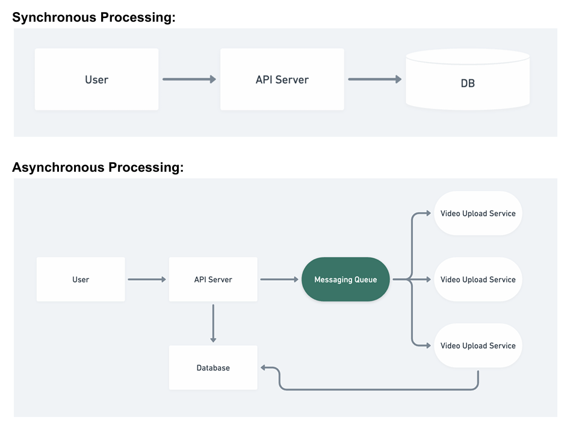

# Cache

## Why should we use cache?

Caches help make things faster by eliminating the following:
● Network I/O
● DiskI/O
● Costly Computations

.png>)

### Frequently Used Caches

1. Redis
2. Memcached

## How is Cache Updated?

### Pull-Based Approach

Also known as ‘Lazy Population’
Pull based approach is similar to ‘Cache Miss’ approach described above

#### Use cases

- Almost all standard cache-uses follow pull-based approach

### Push-Based Approach

Also known as ‘Eager Population’
.png>)

#### Use cases for Push-Based Approach

1. Live Cricket Scores
2. Celebrity posts on social media

### Why can’t We Cache Everything?

Because Caches are very costly. Using Caches in your design is a trade-off between cost and latency.

## Cache Writing Policies

When designing systems, it’s important to consider, Where do we store the data first? In DB
or in Cache?

### 1. Write-Through Cache

The write-through mechanism writes on the cache as well as on the database.
Writing on both storages can happen concurrently or one after the other.
This increases the write latency but ensures strong consistency between the database and the cache.
Write-Through Cache is used for sensitive data and where consistency really matters. This is only policy which grantee between database and cache.

### 2. Write-Back Cache

In the write-back cache mechanism, the data is first written to the cache and asynchronously written to the database.
Although the cache has updated data, inconsistency is inevitable in scenarios where a client reads stale data from the database. However, systems using this strategy will have small writing latency.
Write-Back cache is used in technical product at grass root level such as os, kernals etc. Is used to improve hardware performance.

### 3. Write-Around Cache

This strategy involves writing data to the database only. Later, when a read is triggered for the data, it’s written to cache after a cache miss. The database will have updated data, but such a strategy isn’t favourable for reading recently updated data.
Write-Around is used for most of social media platforms.

### Questions-about Write-through policy?

1. Asystem wants to write data and promptly read it back. At the same time, we want consistency between the cache and database. Which writing policy is the optimal choice?
2. With reference to performance, what should a write-heavy system avoid?
3. Outdated or stale data entry is a typical issue in which writing policy?

## Eviction Policies

Caches are small, and thus fast. Since we can’t store everything in the cache, therefore, we need an eviction mechanism to remove less frequently accessed data from the cache.

The most frequently used cache eviction policies are:

1. Least Recently Used (LRU)
2. Least Frequently Used (LFU)
3. First In First Out (FIFO)

**Pull based mechanism + write-around + Least Recently used(LRU) is most common used cache.**

### Data Temperatures

Data can be classified into three temperature regions depending on the access frequency:

**Hot**: This is highly accessed data.
**Warm**: This is less frequently accessed data.
**Cold**: This is rarely accessed data.

Cold data frequently gets evicted from the cache and gets replaced with hot or warm data.

### Cache Invalidation

Apart from the eviction of less frequently accessed data, some data residing in the cache may become stale or outdated over time. Such cache entries are invalid and must be marked for deletion. No data in cache is stale(old). Cache knows when data has entered

#### How do we identify stale data?

Caches maintain metadata about each cache entry. The metadata includes a value called ‘Time To Live (TTL)’.
We can use two different approaches to deal with outdated items using TTL:

1. Active expiration:
   This method actively checks the TTL of cache entries through a daemon process or thread.
2. Passive expiration:
   This method checks the TTL of a cache entry at the time of access.
   Each expired item is removed from the cache upon discovery.
   works during read or when ever data is accessed it will check if data is stale or not by checking its TTL.

## Storage Mechanism

In case of distributed cache, it’s important to understand the following to improve the performance of distributed cache:
● Which data should we store in which cache server?
● What data structure should we use to store the data?

### Hash Function

It’s possible to use hashing in two different scenarios:

1. Identify the cache server in a distributed cache to store and retrieve data.
   ○ Simple hashing won’t work in case of server failures or while scaling
   ○ Consistent hashing is best suited for this
2. Locate cache entries inside each cache server
   ○ Typical hash functions to locate a cache entry to read or write inside a cache
   server
   ○ **Cons**
   ■ Doesn’t say anything about how to implement a strategy to evict less frequently accessed data from the cache server
   ■ Doesn’t say anything about what data structures are used to store the data within the cache servers

### Linked List

Doubly Linked List is more suited for this use-case.

**Why so?**
Adding and removing data from the doubly linked list in our case will be a constant time operation.
This is because we either evict a specific entry from the tail of the linked list or relocate an entry to the head of the doubly linked list. Therefore, no iterations are required.

## Scaling Caches

Caches scale the same as Databases i.e.

1. Horizontal Scaling(Sharding cache)
2. Vertical Scaling

## Sharding In Caches

To avoid SPOF and high load on a single cache instance, we split up cache data among multiple cache servers. It can be performed in the following two ways.

1. Dedicated Cache Servers
   Cache is separated from the App/Web/API servers
   **Pros:**
   ● There’s flexibility in terms of hardware choices for each functionality
   ● It’s possible to scale web/application servers and cache servers separately
   **Cons:**
   ● Needtoensure that data from different applications don’t collide
   .png>)

2. Co-located Cache
   The co-located cache embeds cache and service functionality within the same host.
   **Pros:**
   ● Themainadvantage of this strategy is the reduction in CAPEX and OPEX of extra
   hardware
   ● Withthe scaling of one service, automatic scaling of the other service is obtained
   **Cons:**
   ● Thefailure of one machine will result in the loss of both services simultaneously

.png>)

---

## Caching Levels

Caching happens primarily at 4 different levels

- Client Side Caching
- Content Delivery Networks (CDNs)
- Remote Cache (Redis)
- Database Caching

### Client Side Caching

- Stores frequently accessed data on client side  
  Example: Web browsers (browser cache), mobile phones (app cache)

- Caches static (almost static) data such as images, js files, user-information (non-sensitive)

- Data invalidation is performed through time-based expiration policy

**Advantages:**

- Performance Improvement: Significantly increases the performance as no external request is made to fetch cached resources
- Reduces load time (Enhances load speed): Accessing resources locally is significantly faster, improving user experience
- Reduces server load: Request for resources can be satisfied by the local cache without a network request to the server

**Considerations:**

- Stale Data: Cached information might be outdated (stale); mechanisms are needed to validate and update cached data
- Cache Size Management: Local storage resources are limited, efficient cache policies must be enforced (example: LRU cache eviction policy)

### Content Delivery Network (CDNs)

- CDNs are a set of servers distributed across the world, with the intent of a CDN (server or datacenter) being closer to a significant user base
- CDNs are used to provide high availability and performance by geographically distributing servers closer to end users’

**Advantages:**

- Improved website load times: By caching / bringing content closer to the users
- Reduced bandwidth costs: Through cache optimization, less data is transferred
- Enhanced content availability and redundancy: Even if one server fails, the network can redirect traffic to other servers

**Considerations:**

- CDN costs: Higher traffic sites benefit more from a cost perspective
- Data Security: Ensure secure transmission of data, consistent with privacy and security regulations

CDNs use PULL-based strategy for updating data in CDNs

Browser Caching + CDNs are a very strong way to reduce website response time, and reduce server load

### Remote Cache (Redis)

Remote caching involves a dedicated server or cluster where applications can read and write data

**Advantages:**

- Speed: Redis maintains data in RAM, facilitating quick read and write operations
- Scalability: Easily scales with growing data needs, supporting high-throughput
- Data Structure Support: Supports data structures such as strings, hashes, lists and sets

**Considerations:**

- Persistence: Requires additional configuration to persist data, as Redis is primarily in-memory
- Memory Leak: Every key stored should have an expiration, else data will stay forever in Redis
- Redis is way too smaller in size compared to a DB, thus we have to be particularly careful about what we cache

### Database Caching

- Involves storing results sets or frequently used computations to prevent complex DB queries
- Instead of running the complex queries involving joins, we can store the pre-computed results in materialised views or DB tables for faster response

**Examples:**

- Pre Computing news feed for social media users, top 20 posts for each daily active users

---

## Messaging Queues (MQ)

A Messaging Queue (MQ) is a component in a system that manages messages. It allows
applications to communicate by sending messages to each other without needing to be
connected simultaneously. One system puts a message onto the queue, and another system
retrieves that message later, processes it, and maybe even sends a response.

Messaging queues are used primarily for asynchronous processing (Examples:
Pre-processing of images and videos, sending bulk emails, spinning up AWS instances, etc)

### Why do we need Asynchronous processing

For providing better user experience. Users won’t have to wait for the process to finish. They
can continue with their regular work, while we do the heavy lifting on the backend.

We can provide a ‘Status’ on the UI for users to know when the job is completed.

### Synchronous Processing Vs Asynchronous Processing

### Why do we use Messaging Queues

To enable 2 or more services to interact with each other by exchanging messages.
Messaging queues are effective when we have the following 2 use-cases:

- Long running tasks (Example: Uploading large video files)
- Trigger dependent tasks (Example: Pre-processing videos after video upload,
  automated caption generation, etc)

Message Queues are also called Message Brokers

### Features of Messaging Queues

- Helps connect different subsystems
- Brokers act as a buffer for the messages
- Can retain messages for ‘N’ Days
- Can re-queue messages if not already deleted

---

### Why Should We Use MQs

- Decoupling: Helps decouple the producer from the consumer. Producer services
  don’t need to know about the consumer services
- Scalability: In case of server overload, messages will still be available in the queue,
  and can be consumed when the overload is mitigated by adding more nodes
- Resilience and Fault Tolerance: If a service / server fails, messages can still be
  retained in the queue, ensuring that no user data is lost. Once the service is back up
  and running, it can start processing the messages from where it left off.
- Asynchronous Communication: Systems can continue execution without waiting
  for a response from the receiver. Extremely useful in case of long-running tasks
- Ordering and Priority: FIFO queues can ensure that messages are processed in
  the order that they arrive
- Load Levelling: Helps in smoothing out the processing needs when there are spikes
  in load

### Popular Messaging Queues

- RabbitMQ
- Apache Kafka
- Amazon SQS
- Microsoft Azure Service Bus
- Google Cloud Pub/Sub

### MQ Best Practices

- Idempotency: Ensure that processing a message more than once does not have a
  different effect. This is crucial because sometimes a consumer might crash after
  processing a message but before acknowledging its receipt, leading to the same
  message being processed multiple times.
- Monitoring and Alerting: Always monitor the queue length and processing times to
  detect problems early
- Dead Letter Queues (DLQ): Use DLQs to handle messages that can't be
  processed. This ensures that problematic messages don't block the processing of
  other messages.
- Batch Processing: Some MQ systems allow consuming messages in batches,
  which can improve performance.
