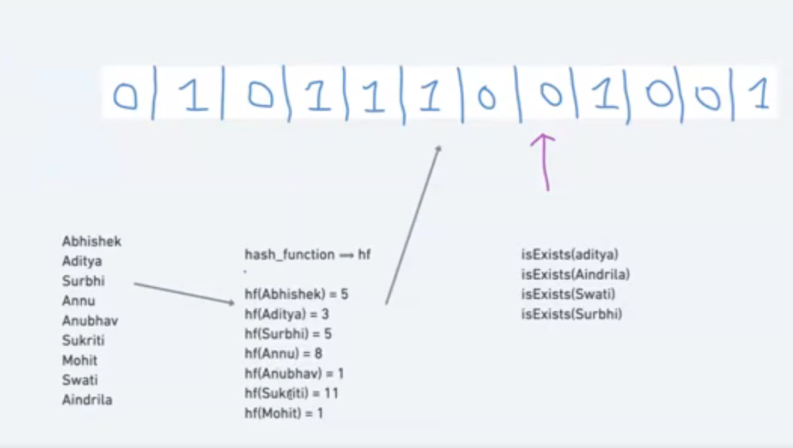
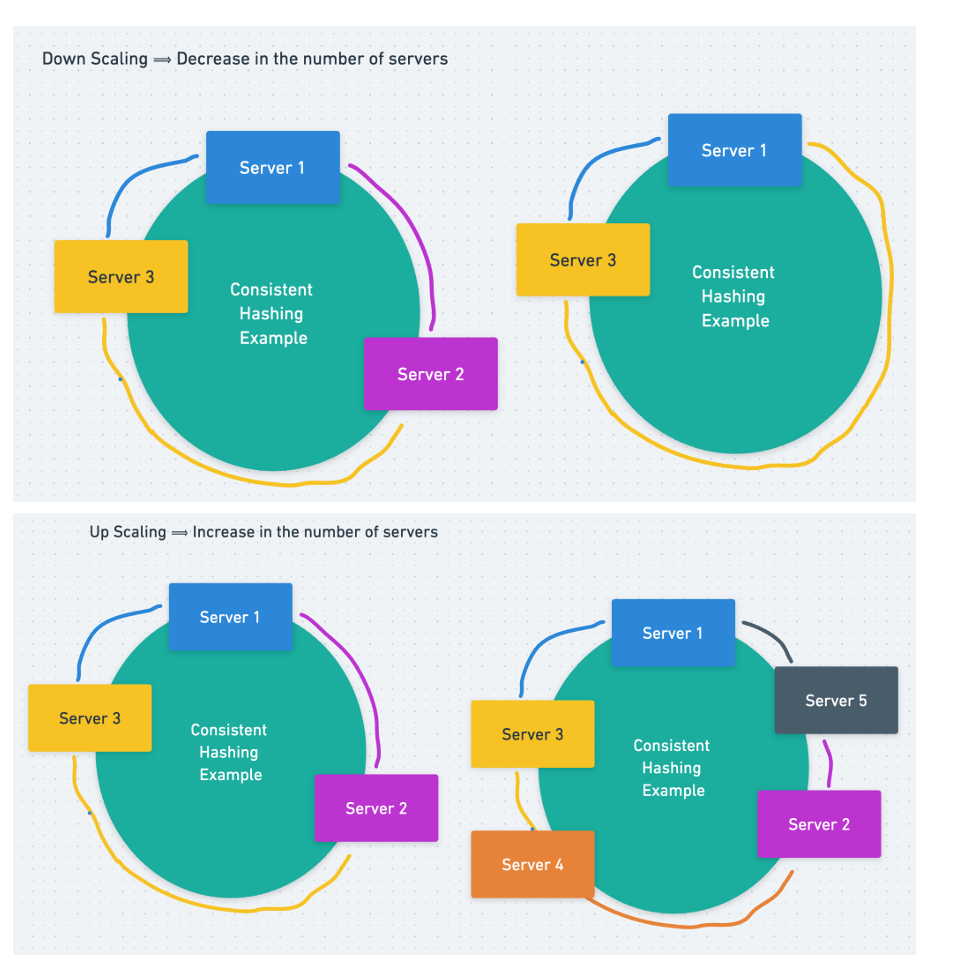
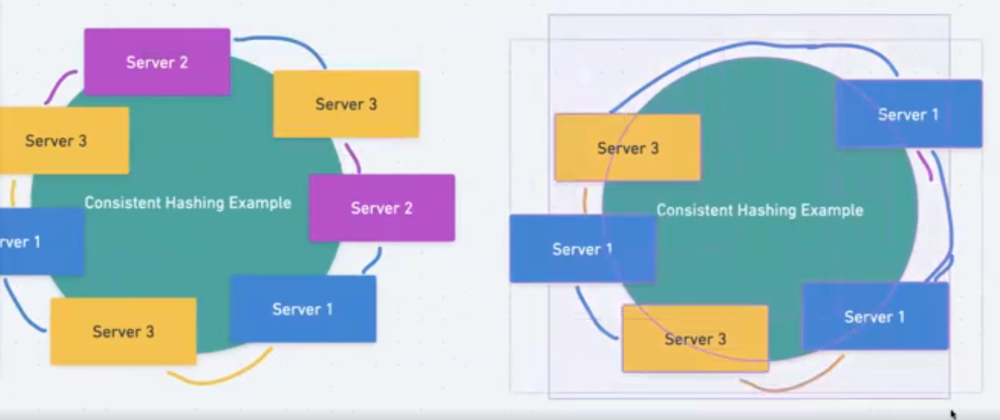

# Bloom Filters, Consistent Hashing and Capacity Estimation

## What is Bloom Filter?

Bloom filters are an efficient data structure that helps you quickly determine if an element is in a set or not. They are particularly useful in situations where the set is large, and you want to reduce the use of memory and increase speed. Here's an overview with examples and a visual representation:

### Understanding Bloom Filters

**Concept:**
A Bloom filter is a probabilistic data structure. It tells you if an element is definitely not in the set or might be in the set.

**How It Works:**

- A Bloom filter uses an array of bits (all initially set to 0) and several hash functions.
- When you add an item to the filter, you pass it through all the hash functions. Each hash function maps the item to a position in the bit array, and the bits at these positions are set to 1.
- To check if an item is in the set, you pass it through the hash functions again. If all the bits at the mapped positions are 1, the item might be in the set. If any bit is 0, the item is definitely not in the set.

**False Positives:**
Bloom filters can tell you with certainty if an item is not in the set, but they can give false positives (saying an item is in the set when it isn't).

**No False Negatives:**
There are no false negatives; if a Bloom filter says an item is not in the set, it is not.

once it is set to 1 it can't be set as 0. It's time complexity is almost O(1). It is implemented based on array or bitSet not hashmap or set because of maintaining keys for multiple users.

### Examples in System Design

**Network Applications:**
Used to quickly check if a URL or an IP address is part of a blocklist.

**Database Systems:**
Before accessing disk storage, databases can use Bloom filters to check if a record exists, reducing unnecessary disk reads.

**Cache Filtering:**
To check if a particular data is already cached.

**Recommendation Systems / Feed Generation System:**
To ensure we don’t show the same content to a user twice.

### Real-World Bloom Filters

- Redis provides Bloom Filters as one of its features

---

## What is Consistent Hashing?

Consistent hashing is a technique used in distributed systems to evenly distribute data across a cluster of nodes, such as servers or databases, and to minimize reorganization when nodes are added or removed. Here's an overview along with examples and diagrams:

### Understanding Consistent Hashing

**Basic Concept:**  
Consistent hashing maps data to a node in a system so that when the number of nodes changes, only a minimal amount of data is moved.

**Hash Ring:**  
Imagine a circular space (like a clock) where each point on the ring represents a hash value. Both data items and nodes are mapped onto this ring based on their hash values.

**Data Assignment:**  
Data is assigned to the nearest node on the ring in a clockwise direction. Each node is responsible for the data that falls between it and the previous node on the ring.

**Scaling:**  
When a new node is added, it takes its position on the ring and takes responsibility for some data from the node next to it. When a node is removed, its data is taken over by the next node.

Its job of Load balancer to maintain the key and send to right server after restructure.

### Examples in System Design for consistent hashing

**Distributed Caches:**  
In a distributed cache system, consistent hashing ensures that when a cache machine is added or removed, only a small portion of the cache keys need to be remapped to different machines.

**Load Balancing:**  
It can be used for load balancing in distributed web services, where requests are evenly distributed across a pool of servers.

we can always replicate one server to get better distribution. This is actual implementation. we can also maintain sticky session with consistent hashing algorithm. For non consistent hashing algo we need to explicitly map traffic.

---

## Capacity Estimation

**Real-life example:** Packing for a trip  
**Tech Example:** Instagram

## Capacity Estimation for Instagram

### Storage Estimation

- Users ⇒ DAU: 1 M  
  (DAU ⇒ Daily Active User, MAU ⇒ Monthly Active User)
- Posts per user: 2 posts
- Size of a post: 5 MB

**Formula:**  
DAU*Posts per day_Size of a post \_30 (month)* 12 (year)

**Calculation:**  
1 _ 2 _ 5 \* 360 = 3600 MB = 3.6 GB

---

### Throughput Estimation

- 1M \* 2 = 2 Million request / day

**Queries per second (QPS):**  
2 M / 86400 = 23 qps

**Server capacity:**  
1 server can handle = 5 qps

**Total number of servers:**  
= 5 servers

---

### Read / Write Estimation

- **Write Requests:**  
  1 M \* 2 photos = 2 million write requests to DB

- **How many photos does each user see per day?**  
  = 10

- **Read Requests:**  
  1 M \* 10 = 10 million read requests

- **Read / Write ratio:**  
  10 / 2 = 5

Learnings:

1. Divide a problem into smaller components then compute each of them individually and perform sum at last.
2. Avoid bias recency/frequency bias and proxymacy bias.
3. You can visit similarweb.com to check for your competitive
4. Follow single responsibility for each component
