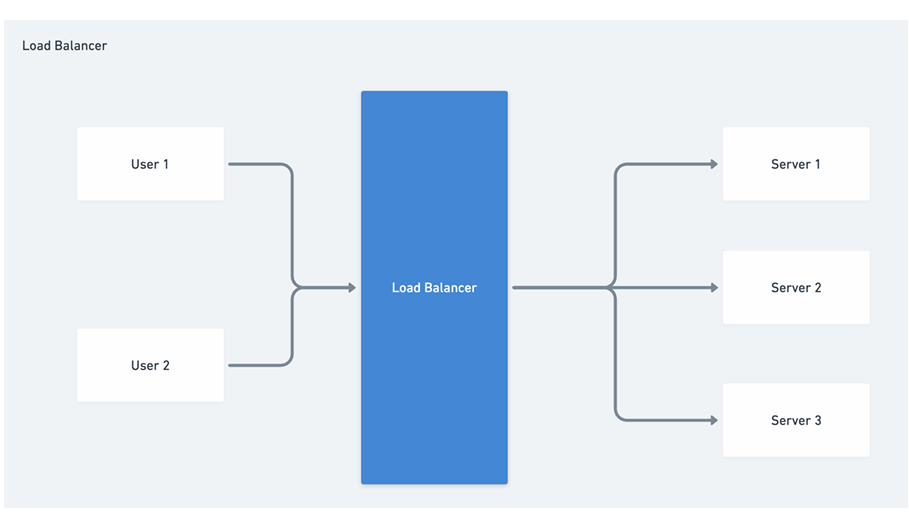

# Load Balancers

## Load Balancers (LBs)

Load balancer is a device / service which distributes incoming network traffic across multiple backend servers.

Load Balancers (LBs) are one of the most frequently used system design components, as they are used in every distributed and scaled system.

Load Balancers is the first POC(Point of contact) for user.

For an external user, Load Balancer is the only point of direct contact

### Why should we use a LB?

- **Distribute Traffic:** Prevent any single server from getting overloaded, thus maintaining performance.
- **Scalability:** Easily add or remove servers based on traffic demands.
- **Fault Tolerance & High Availability:** If one server fails, the LB redirects traffic to the remaining operational servers.
- **Maintain Session Persistence:** Some applications require a user's session to be processed by the same server they initially connected to. Load balancers can be configured for "sticky sessions" to handle this.

### Types of LB

- **Layer 4 Load Balancing (Transport Layer):** Based on IP address and port. It's fast and efficient since it doesn't inspect packet content.
- **Layer 7 Load Balancing (Application Layer):** Distributes requests based on content type, URL, or other HTTP header information.  
  It allows for more complex and customizable distribution strategies, like directing traffic based on URL patterns or the type of device making the request.

### Load Balancing Algorithms

- **Round Robin:** Requests are distributed sequentially to each server. Suitable for servers with similar specifications.
- **Weighted Load Balancing:** Assigns a weight to each server based on its capacity and performance. Servers with higher weights receive more requests than those with less weight.
- **Least Connections:** Directs traffic to the server with the fewest active connections. Useful when servers have varying capabilities.
- **Least Response Time:** Directs traffic to the server with the fastest response time for a new connection.
- **IP Hash:** Determines the server to send a request based on the IP address of the client. Useful for maintaining client (or session) stickiness.

### Popular LBs

- Nginx
- HAProxy
- AWS Elastic Load Balancing (ELB)

### Challenges and Considerations

- **Session Persistence:** As mentioned, some applications need all requests from a user session to be directed to the same server.
- **SSL Termination:** Decrypting SSL traffic at the load balancer before sending it to backend servers can offload the decryption overhead from the servers. However, this might raise security concerns in some scenarios.
- **Distributed Load Balancing:** In globally distributed systems, directing users to the nearest data center can reduce latency.
- **Scaling the Load Balancer:** In very high-traffic scenarios, even the load balancer can become a bottleneck. Solutions include DNS-level load balancing or using a tiered load balancing approach.
