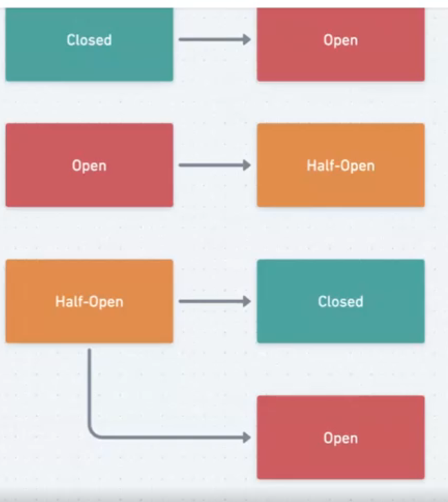
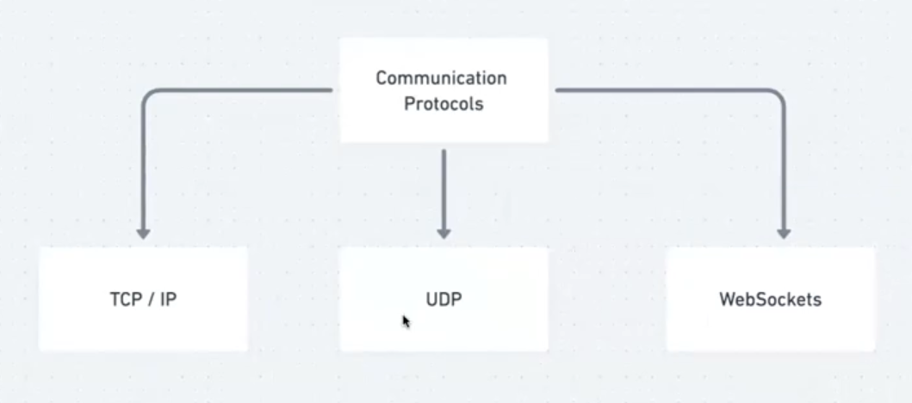
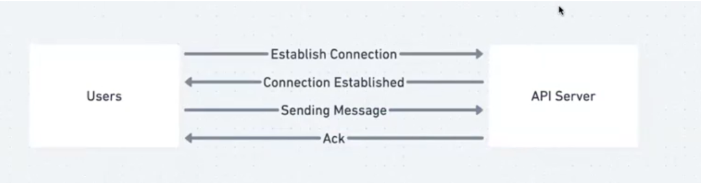

# Load Balancers, Circuit Breakers and Communication Protocols

## Load Balancers (LBs)

Load balancer is a device / service which distributes incoming network traffic across multiple backend servers.

Load Balancers (LBs) are one of the most frequently used system design components, as they are used in every distributed and scaled system.

Load Balancers is the first POC(Point of contact) for user.

For an external user, Load Balancer is the only point of direct contact

### Why should we use a LB?

- **Distribute Traffic:** Prevent any single server from getting overloaded, thus maintaining performance.
- **Scalability:** Easily add or remove servers based on traffic demands.
- **Fault Tolerance & High Availability:** If one server fails, the LB redirects traffic to the remaining operational servers.
- **Maintain Session Persistence:** Some applications require a user's session to be processed by the same server they initially connected to. Load balancers can be configured for "sticky sessions" to handle this.

### Types of LB

- **Layer 4 Load Balancing (Transport Layer):** Based on IP address and port. It's fast and efficient since it doesn't inspect packet content.
- **Layer 7 Load Balancing (Application Layer):** Distributes requests based on content type, URL, or other HTTP header information.  
  It allows for more complex and customizable distribution strategies, like directing traffic based on URL patterns or the type of device making the request.

### Load Balancing Algorithms

- **Round Robin:** Requests are distributed sequentially to each server. Suitable for servers with similar specifications.
- **Weighted Load Balancing:** Assigns a weight to each server based on its capacity and performance. Servers with higher weights receive more requests than those with less weight.
- **Least Connections:** Directs traffic to the server with the fewest active connections. Useful when servers have varying capabilities.
- **Least Response Time:** Directs traffic to the server with the fastest response time for a new connection.
- **IP Hash:** Determines the server to send a request based on the IP address of the client. Useful for maintaining client (or session) stickiness.

### Popular LBs

- Nginx
- HAProxy
- AWS Elastic Load Balancing (ELB)

### Challenges and Considerations

- **Session Persistence:** As mentioned, some applications need all requests from a user session to be directed to the same server.
- **SSL Termination:** Decrypting SSL traffic at the load balancer before sending it to backend servers can offload the decryption overhead from the servers. However, this might raise security concerns in some scenarios.
- **Distributed Load Balancing:** In globally distributed systems, directing users to the nearest data center can reduce latency.
- **Scaling the Load Balancer:** In very high-traffic scenarios, even the load balancer can become a bottleneck. Solutions include DNS-level load balancing or using a tiered load balancing approach.

---

## Circuit Breakers

### Why Do We Need Circuit Breaker

In a distributed system, services often depend on other services. If a dependent service fails or becomes slow, it can cause the calling service to become slow or fail as well, leading to cascading failures throughout the system.

Circuit breakers help prevent cascading / recurring failures. Let’s understand with an example (on whimsical and recorded video)

Job of circuit breaker is to make sure if something is not working we just disable the small subset interest of whole system not failing.Here we intestinally breaking system from server side

### Circuit Breaker States

A circuit breaker has three primary states:

- **Closed:** Everything is functioning normally. Requests to the service are allowed.
- **Open:** The circuit breaker has detected failures and blocks all calls to the failing service.
- **Half-Open:** After a certain time, the circuit breaker allows a limited number of test requests to pass through. If those requests succeed, the circuit breaker closes; otherwise, it remains open.

### Transition Triggers

- From Closed to Open: When failure rates cross a predefined threshold.
- From Open to Half-Open: After a predefined "reset" interval.
- From Half-Open to Closed or Open: Based on the success or failure of the test requests.

### Advantages

- **Fail Fast:** The system can quickly detect and isolate failures, ensuring that clients aren't stuck waiting for requests that are bound to time out or fail.
- **Resilience:** Provides a mechanism to let a failing service recover without being overwhelmed with incoming requests.
- **Feedback:** Monitoring the circuit breaker states can provide essential feedback on the system's health.

### Implementation Considerations

- **Thresholds and Timing:** You need to define thresholds (e.g., 50% failure rate) to transition from a closed to open state. Similarly, determine how long the circuit breaker should stay open before transitioning to half-open.
- **Fallback Strategies:** When a circuit breaker trips, you need a strategy. This could be serving a cached version of the data, using default values, or returning an error.
- **Network Failures vs. Application Failures:** Decide whether the circuit breaker should trip for both network and application-level errors or just one of them.
- **External Configuration and Monitoring:** Implementing circuit breakers using external libraries or services like Hystrix (from Netflix) can provide better control and monitoring capabilities.

### Use-Cases

- **Microservices:** Particularly beneficial in microservices architectures where a failure in one service shouldn't cascade to others.
- **Third-party Service Integrations:** If your system depends on third-party services, you don't control those services' uptime. A circuit breaker can prevent issues in these third-party services from affecting your system.
- Netlix uses Hystrix

---

## Communication Protocols

### Transmission Control Protocol (TCP)

**Example:** Phone Call

TCP is a connection-oriented, reliable, byte-stream protocol. It's one of the main protocols in the Internet protocol suite and operates on top of the Internet Protocol (IP).

**Features:**

- Reliability: Ensures data is delivered without errors and in the correct order. Lost packets are retransmitted
- Connection-oriented: A connection is established between the sender and the receiver before any data is sent
- Flow Control: Ensures data is sent at a rate the receiver can handle
- Ordered Data Transfer: Packets are received in the same order they are sent
- Error Checking: Checksums are used to verify data integrity

**Use Cases:**

- Web browsing (HTTP/HTTPS)
- File transfer (FTP)
- Email (SMTP)

---

### WebSockets

**Example:** Walkie Talkie

It's main purpose it to reduce the number of connection while providing low latency. Consider whatsapp if we want to communicate on tcp we will need 60connection for a min. We can use long pooling which may reduce to 6 connection considering each connection will last for 10sec. Web socket solves problem where we requires continues connection where user will only open connection if he wants to send message else it server who opens the connection and sends message to user.

WebSockets provide a full-duplex communication channel over a single, long-lived connection, designed to work over the same ports as HTTP and HTTPS.

**Features:**

- Full-duplex: Allows simultaneous bidirectional communication
- Low Latency: Reduces overhead and latency compared to polling
- Persistent Connection: Connection remains open, enabling real-time transfer
- Operates over HTTP: Starts with HTTP handshake then upgrades to WebSocket protocol

**Use Cases:**

- Real-time apps: chat, gaming, live sports updates
- Financial tickers
- Collaborative tools (real-time document editors)

---

### How does long polling?

1. Client sends request to server.
2. Server holds request until new data is available or timeout occurs.
3. Server responds with new data.
4. Client processes and immediately sends a new request.

**Advantages:**

- Reduced Latency
- More efficient than regular polling

**Disadvantages:**

- Resource intensive on server
- More complex implementation
- Scalability issues with large client base

---

### Unified Datagram Protocol (UDP)

**Example:** Postcards, One way lectures

UDP is a connectionless, unreliable protocol. It sends datagrams without establishing a connection and without guaranteeing delivery or ordering.

**Features:**

- Connectionless
- Unreliable: No guarantee of delivery/order
- Low Overhead
- No Error Recovery

**Use Cases:**

- Streaming media (video, voice)
- Online gaming
- Broadcasting
- DNS queries

### System Design Considerations

**Choosing the Right Protocol:**

- TCP: When reliability and order are critical
- UDP: When speed is more important than reliability
- WebSockets: Real-time bi-directional communication

**Scalability and Performance:**

- TCP’s error-checking slows performance vs. UDP
- Each protocol impacts scaling differently

**Security Considerations:**

- TCP/IP and WebSockets can implement robust security
- UDP is inherently less secure

---

## What is Amazon S3?

Amazon S3 is a scalable object storage service offered by AWS. It stores and retrieves any amount of data from anywhere on the web.

**Key Features:**

- **Scalability:** Automatically scales with usage
- **Durability and Availability:** Stores data across multiple facilities
- **Security:** Access control and encryption
- **Data Management:** Lifecycle policies, versioning
- **Flexible Storage Classes:** For frequent, infrequent, and archival needs

## Use Cases in System Design

- **Backup and Storage:** Database backups, disaster recovery
- **Hosting Static Websites:** HTML, CSS, JS, media (with CloudFront for CDN)
- **Big Data Analytics:** Store large datasets for processing with AWS services
- **Content Delivery and Media Hosting:** Media files delivered globally with CloudFront

## Architectural Examples

- **Web Application Architecture:**  
  Static content in S3, dynamic content handled by EC2 and RDS

- **Data Lake Architecture:**  
  S3 as central data lake for structured & unstructured data, processed via AWS analytics tools
