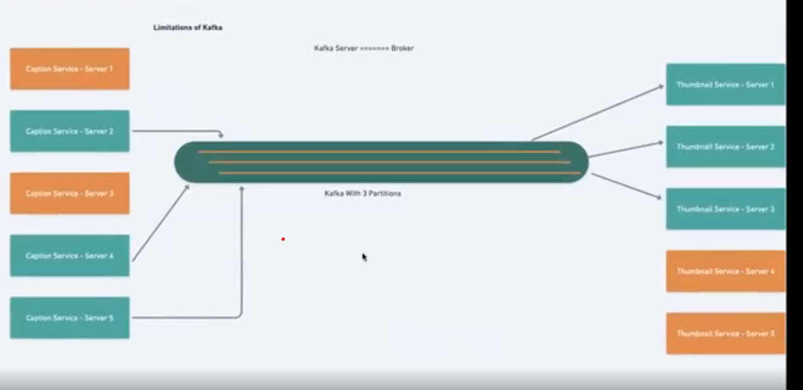
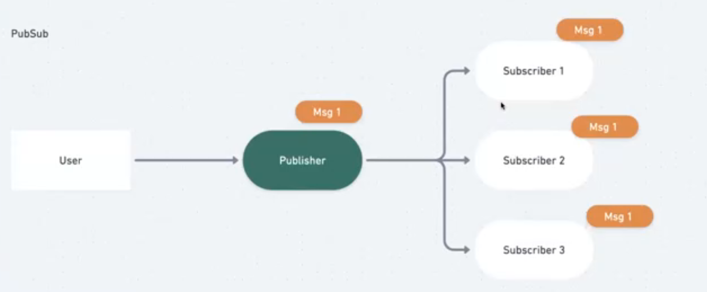

# Messaging Queues (MQ) and Messaging Streams

## Messaging Queues (MQ)

A Messaging Queue (MQ) is a component in a system that manages messages. It allows
applications to communicate by sending messages to each other without needing to be
connected simultaneously. One system puts a message onto the queue, and another system
retrieves that message later, processes it, and maybe even sends a response.

Messaging queues are used primarily for asynchronous processing (Examples:
Pre-processing of images and videos, sending bulk emails, spinning up AWS instances, etc)

### Why do we need Asynchronous processing

For providing better user experience. Users won’t have to wait for the process to finish. They
can continue with their regular work, while we do the heavy lifting on the backend.

We can provide a ‘Status’ on the UI for users to know when the job is completed.

### Synchronous Processing Vs Asynchronous Processing

### Why do we use Messaging Queues

To enable 2 or more services to interact with each other by exchanging messages.
Messaging queues are effective when we have the following 2 use-cases:

- Long running tasks (Example: Uploading large video files)
- Trigger dependent tasks (Example: Pre-processing videos after video upload,
  automated caption generation, etc)

Message Queues are also called Message Brokers

### Features of Messaging Queues

- Helps connect different subsystems
- Brokers act as a buffer for the messages
- Can retain messages for ‘N’ Days
- Can re-queue messages if not already deleted

---

### Why Should We Use MQs

- Decoupling: Helps decouple the producer from the consumer. Producer services
  don’t need to know about the consumer services
- Scalability: In case of server overload, messages will still be available in the queue,
  and can be consumed when the overload is mitigated by adding more nodes
- Resilience and Fault Tolerance: If a service / server fails, messages can still be
  retained in the queue, ensuring that no user data is lost. Once the service is back up
  and running, it can start processing the messages from where it left off.
- Asynchronous Communication: Systems can continue execution without waiting
  for a response from the receiver. Extremely useful in case of long-running tasks
- Ordering and Priority: FIFO queues can ensure that messages are processed in
  the order that they arrive
- Load Levelling: Helps in smoothing out the processing needs when there are spikes
  in load

### Popular Messaging Queues

- RabbitMQ
- Apache Kafka
- Amazon SQS
- Microsoft Azure Service Bus
- Google Cloud Pub/Sub

### MQ Best Practices

- Idempotency: Ensure that processing a message more than once does not have a
  different effect. This is crucial because sometimes a consumer might crash after
  processing a message but before acknowledging its receipt, leading to the same
  message being processed multiple times.
- Monitoring and Alerting: Always monitor the queue length and processing times to
  detect problems early
- Dead Letter Queues (DLQ): Use DLQs to handle messages that can't be
  processed. This ensures that problematic messages don't block the processing of
  other messages.
- Batch Processing: Some MQ systems allow consuming messages in batches,
  which can improve performance.

---

## Messaging Streams and Kafka

Messaging streams can be thought of as a continuous stream of data, where you can read and process data as it comes in  
(Example: Never ending conveyer belt)

### Use-Cases of Messaging Streams

- Real-time data analytics
- Monitoring
- Fraud Detection
- Real-time recommendations

### Why do we need Messaging Streams?

Covered with live example in Whimsical (Refer to video recordings) along with difference between Messaging Queues and Messaging Streams

### What is Kafka

Apache Kafka is an open-source stream-processing software that can handle trillions of events per day.

### Components of Kafka

- **Producer:** Entities that publish data to topics
- **Consumer:** Entities that read and process data from topics
- **Broker:** Kafka servers that store data and serve clients
- **Topic:** Categories or streams of data to which messages can be published
- **Partition:** Topics are split into partitions for scalability and parallelism. Each partition can be hosted on a different server
- **Zookeeper:** Used for managing and coordinating Kafka brokers. Kafka 2.8 introduced a mode where Zookeeper is no longer required, but prior versions are dependent on it

### Advantages of Kafka

- **Scalability:** Kafka clusters can be scaled out horizontally
- **Durability:** Data is written to persistent storage, so messages are stored even if consumers haven't processed them yet
- **High Throughput:** Kafka can handle millions of events per second
- **Fault Tolerance:** Data is replicated across multiple brokers
- **Low Latency:** Kafka is designed to have a low latency, ensuring data is sent and received in near real-time

### Kafka Best Practices

- **Monitoring:** Monitor brokers, topics, and overall health of the Kafka cluster.
- **Replication:** Ensure topics have the right replication factor to prevent data loss.
- **Backups:** Regularly backup Kafka configurations and metadata.
- **Consumer Management:** Regularly check consumer offsets and lag to ensure messages are being processed in a timely manner.

### Limitations of Kafka

- **Number of consumers = Number of Partitions** (which make harder to perform partitions.)
- Within the partition, messages are ordered. However, no ordering guarantee across partitions

## Realtime PubSub

When we use Messaging Queues or Messaging Streams, we are using the **PULL** method, and the number of unread messages depends on the velocity of incoming messages, and the throughput of the servers. It broadcasts message to all the sub.

However, the above approach can have latency and lag issues. So how do we handle this?

**PubSub** helps us achieve low-latency and zero lag.

## Real-life Use-Cases

- Message Broadcast
- Configuration Push
