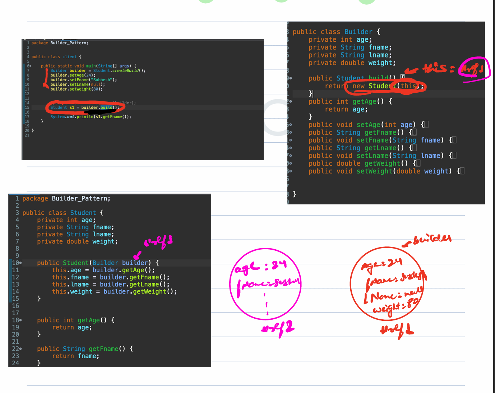
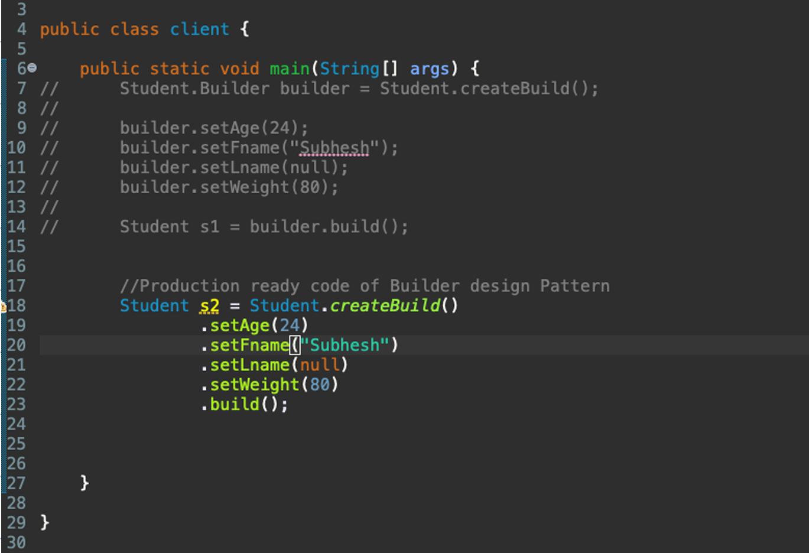
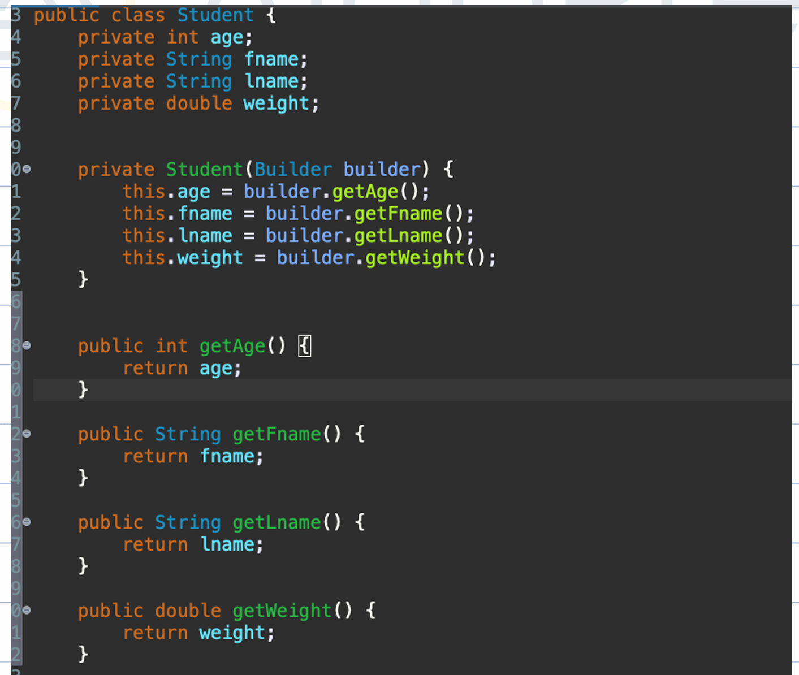
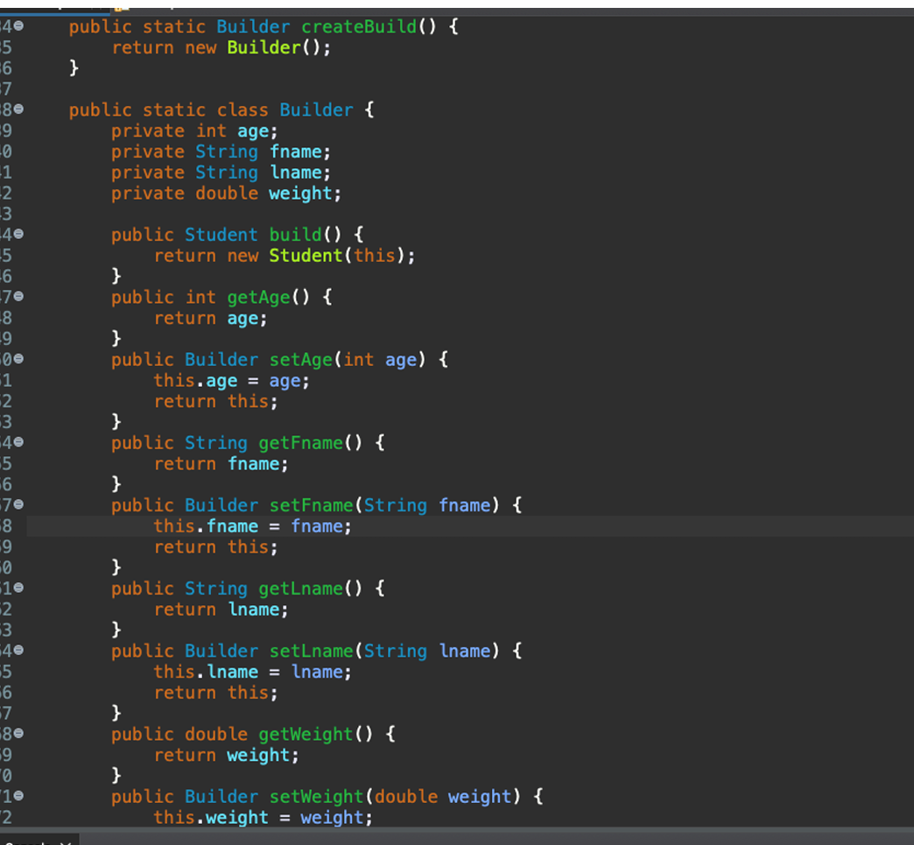
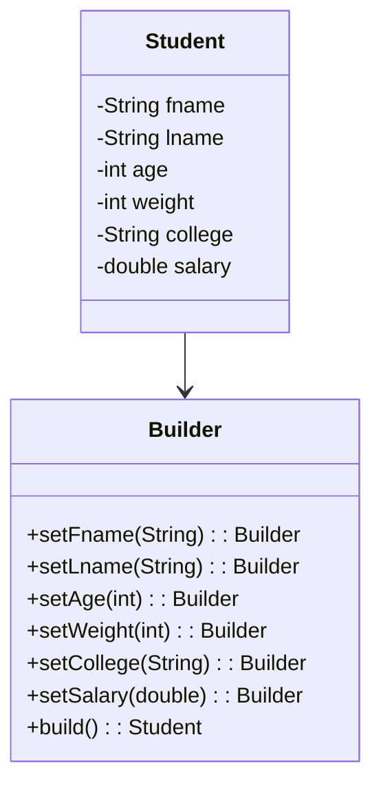

# Builder Design Pattern

## Problem: Creating Object with Many Attributes

### The attributes are immutable (set once and only read later)

```java
class Student {
  private String fname;
  private String lname;
  private int age;
  private int weight;
  private String college;
  private double salary;

  // getters & setters
}
```

### Solution1: we can create getters and setters inside student class to handle the attributes

- Issue with Getters & Setters

```java
Student s = new Student();
s.setFname("Subhash");
s.setAge(24);
s.setWeight(80);
```

- Attributes become **mutable** → values can be changed anytime
- Violates immutability principle
- there will be lot of setter and getters

### Approach 2: Parameterized Constructors

```java
class Student {
  String fname;
  String lname;
  int age;
  int weight;
  String college;
  double salary;

  Student(String fname, String lname, int age, int weight, String college, double salary) {
    this.fname = fname;
    this.lname = lname;
    this.age = age;
    this.weight = weight;
    this.college = college;
    this.salary = salary;
  }
}

Student s = new Student("Subhash", "Kumar", 24, 80, "IIT", 40000);
```

#### Problems

- **Not understandable**
- **Bug-prone**
- Not all attributes are **mandatory**
- Too many possible combinations
- it is not possible to create all combination of constructor
  → leads to **Telescoping Constructors Problem**

#### Telescoping Constructor Problem

When ever there is code duplication(same code to multiple constructor) inside constructor we use telescoping constructor to resolve the issue. If attributes are optional, we may end up creating **many constructors**:

```java
Student(String fname, int age) { this.fname=fanme; this.age=age }
Student(String fname, int age, int weight) { this.fname=fanme; this.age=age; this.weight=weight }
Student(String fname, int age, int weight, String college) { this.fname=fanme; this.age=age; this.weight=weight; this.college=college }
```

we acn use Telescoping constructor

```java
Student(String fname, int age) { this.fname=fanme; this.age=age }
Student(String fname, int age, int weight) { this(fname,age); this.weight=weight }
Student(String fname, int age, int weight, String college) { this(fname,ager,weight) this.college=college }
```

⚠️ Leads to:

- **Code duplication**
- **Unmaintainable**
- **Error-prone**

---

### Approach 3: Alternative: Use a Map (Not Recommended)

Ideally there should be 1 constructor. So we can think of getting all values of attributes in map then athen assign to attributes,

```java
Map<String, Object> val = new HashMap<>();
val.put("fname", "Subhash");
val.put("age", 24);
val.put("weight", 80);

Student s = new Student(val);
```

#### Problems with approach 3

- Keys are **strings** → typos not caught at compile-time
- Example: `val.put("fram", "Subhash");` → Bug! (client can do some typo)
- You might map number to string
- Hard to debug

---

## Final Solution: Builder Pattern

### approach 1: Creting a builder class and let client handles



All point of creating build function inside builder was to avoid passing null by client during class initilzation ie

```java
Student s1 = new Student(null); //since it is constructor is public
```

but client can still pass null wile just adding this line until constructor of student class is private. but when constructor is public even Builder class will not be able to create object.

### Final

We need to set Student constructor to private and move Builder class to Student class.





## Advantages of Builder Pattern

- Avoids **telescoping constructors**
- Provides **readable object creation**
- Handles **optional attributes** gracefully
- Supports **immutability**

---

## When to Use Builder Pattern

- When a class has **many attributes**
- When we want **immutability**

---

### Diagram — Builder Pattern


