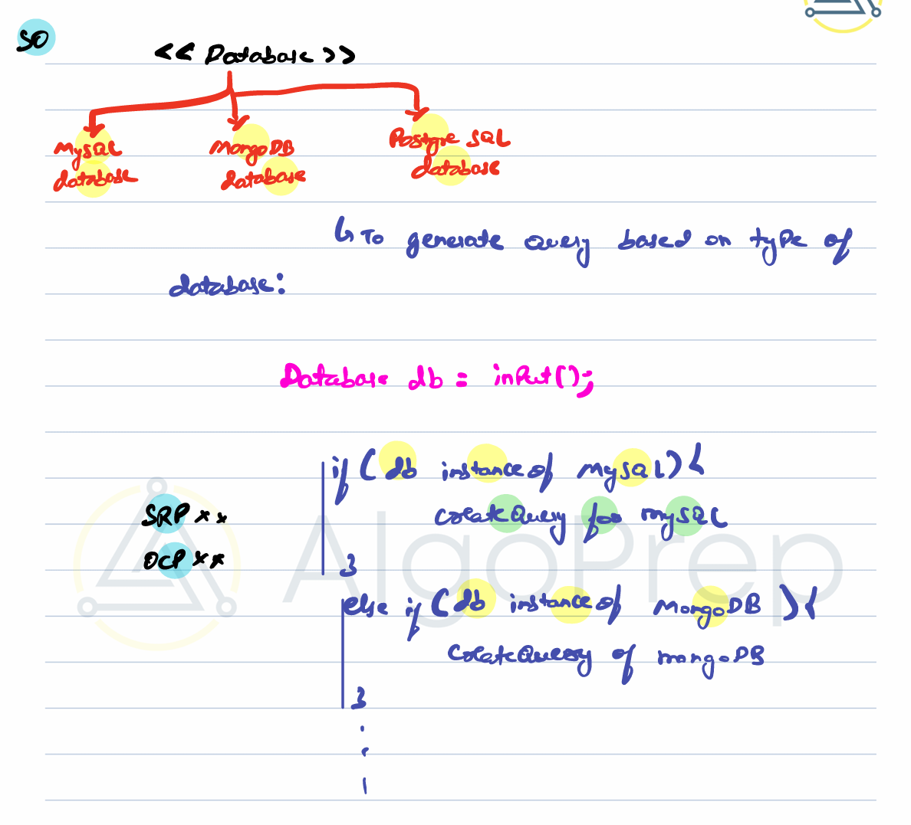
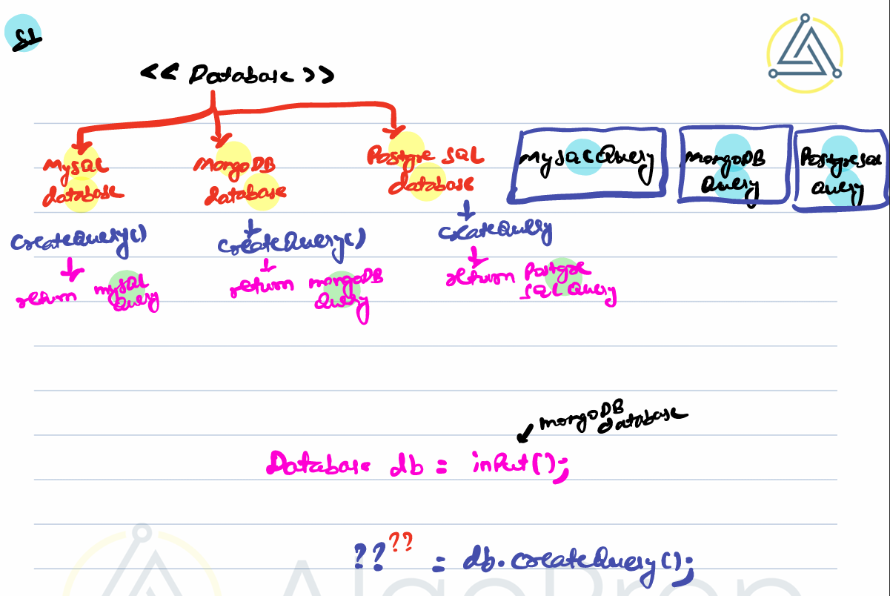
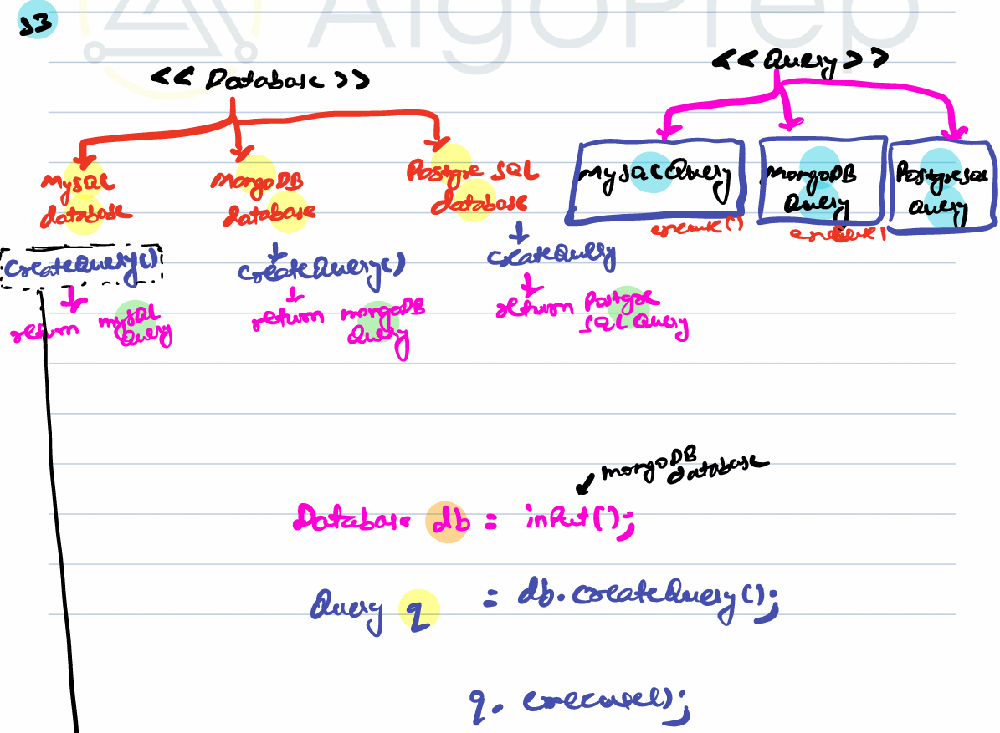
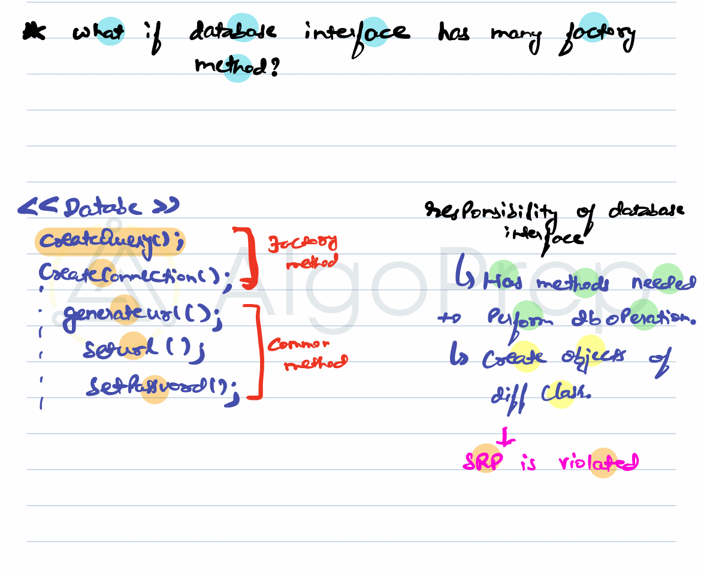
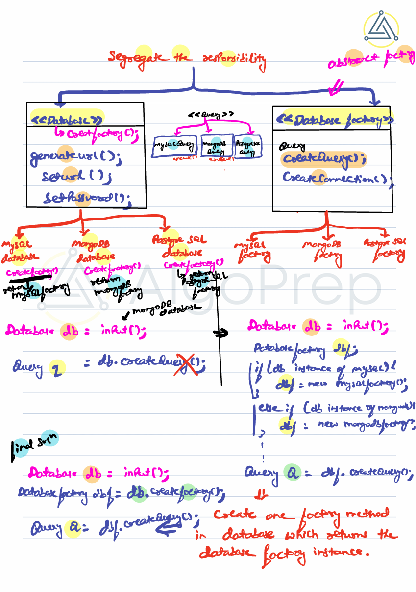

# Factory and Abstract Factory Design Pattern

- **Factory Design Pattern**
- **Abstract Factory Design Pattern**

## Basics

### `Database.java`

```java
package Factory;

public interface Database {
    void createQuery();
}
```

---

### `MySqlDb.java`

```java
package Factory;

public class MySqlDb implements Database {

    @Override
    public void createQuery() {
        System.out.println("I am in MySqlDb class");
    }
}
```

---

### `MongoDb.java`

```java
package Factory;

public class MongoDb implements Database {

    @Override
    public void createQuery() {
        System.out.println("I am in MongoDb class");
    }
}
```

---

### `Client.java`

```java
package Factory;

public class Client {
    public static void main(String[] args) {

        // Direct instantiation examples
        // MySqlDb db1 = new MySqlDb();
        // MongoDb db2 = new MongoDb();

        // Database db = new MySqlDb();
        Database db = new MongoDb(); // Can switch to MySqlDb easily
        db.createQuery();
    }
}
```

we can trigger createQuery() function by calling constructor of class and storing in db.

## Factory Design Pattern

We want to generate queries based on the type of database.

Consider we have three database using in our system. I need to write a method which will get query for the database and it stores the query in same type of db it is being called.

### Approach 0 : worst

create a function which will return query based on database check.



```java
Database db = input;

if (db instanceof MySQL) {
    // createQuery for MySQL
}
else if (db instanceof MongoDB) {
    // createQuery for MongoDB
}
```

### Issues

- Violates **SRP (Single Responsibility Principle)** → too much logic inside
- Violates **OCP (Open/Closed Principle)** → need to modify code whenever a new DB type is added

---

## Approach 1: create method for each db

Create ab interface called createQuery() method and implement in all the three data base.



```java
Database db = new MySQLDatabase();
??? = db.createQuery();
```

✅ Removes `if-else` chains
✅ Each DB class knows how to create its query

### Problems with approach 1

- we don't know where we will store the queryResults. Each database will return query of their own return type.

---

## Approach 2: create another interface for query results

We can crate another interface name as query which will have all the return types for function.



```java
interface Database {
    Query createQuery();
}

class MySQLDatabase implements Database {
    public Query createQuery() {
        return new MySQLQuery();
    }
}

class MongoDatabase implements Database {
    public Query createQuery() {
        return new MongoQuery();
    }
}

Database db = new MySQLDatabase();
Query q = db.createQuery();
```

### Factory Method

A method in aan interface/abstract class whose purpose it to return the object of a certain class.
This createQuery() method is a factory method which return the object of database. ie query for that database

---

### Problem with Multiple Factory Methods


If `Database` also has responsibilities like:

- `createConnection()`
- `setURL()`
- `setPassword()`
- `execute()`

→ It becomes **bloated** and violates **SRP**.

---

## Step 2: Abstract Factory Pattern

Instead of keeping all factory methods inside `Database`, **segregate responsibilities** into separate factory classes.



- Abstract Factory

```java
interface DatabaseFactory {
    Query createQuery();
    Connection createConnection();
}
```

- Full Code

### `Query.java`

```java
package Factory;

public interface Query {
    void execute();
}
```

---

### `MySqlQuery.java`

```java
package Factory;

public class MySqlQuery implements Query {
    @Override
    public void execute() {
        System.out.println("Executing MySQL Query");
    }
}
```

---

### `MongoDbQuery.java`

```java
package Factory;

public class MongoDbQuery implements Query {
    @Override
    public void execute() {
        System.out.println("Executing MongoDB Query");
    }
}
```

---

### `DatabaseFactory.java`

```java
package Factory;

public interface DatabaseFactory {
    Query createQuery();
}
```

---

### `MySqlFactory.java`

```java
package Factory;

public class MySqlFactory implements DatabaseFactory {
    @Override
    public Query createQuery() {
        return new MySqlQuery();
    }
}
```

---

### `MongoDbFactory.java`

```java
package Factory;

public class MongoDbFactory implements DatabaseFactory {
    @Override
    public Query createQuery() {
        return new MongoDbQuery();
    }
}
```

---

### `Database.java` for final code

```java
package Factory;

public interface Database {
    DatabaseFactory createFactory();
}
```

---

### `MySqlDb.java` for final code

```java
package Factory;

public class MySqlDb implements Database {
    @Override
    public DatabaseFactory createFactory() {
        return new MySqlFactory();
    }
}
```

---

### `MongoDb.java` for final code

```java
package Factory;

public class MongoDb implements Database {
    @Override
    public DatabaseFactory createFactory() {
        return new MongoDbFactory();
    }
}
```

---

### `Client.java` for final code

```java
package Factory;

public class Client {
    public static void main(String[] args) {
        // Step 1: Take database input (MySQL or Mongo)
        Database db = input();

        // Step 2: Get corresponding factory
        DatabaseFactory dbf = db.createFactory();

        // Step 3: Factory creates a Query object
        Query q = dbf.createQuery();

        // Step 4: Use the query
        q.execute();
    }

    private static Database input() {
        // Example: Returning MySqlDb
        // This can be changed based on config/env/user input
        return new MySqlDb();
    }
}
```

---

## Flow of Abstract Factory Method

1. **Client wants to work with a Database** but doesn’t know if it’s MySQL or Mongo.

   - So, it calls `Database db = input();`.

2. **Database (MySqlDb or MongoDb)** knows which **Factory** to return.

   - For MySQL → returns `MySqlFactory`
   - For Mongo → returns `MongoDbFactory`

3. **Factory creates objects specific to that DB.**

   - `MySqlFactory.createQuery()` → returns `MySqlQuery`
   - `MongoDbFactory.createQuery()` → returns `MongoDbQuery`

4. **Client code stays same**:

   ```java
   Query q = dbf.createQuery();
   q.execute();
   ```

✅ This removes `if-else` chains and achieves:

- **SRP** → Each factory only handles its DB object creation.
- **OCP** → New DBs can be added without modifying existing client logic.
- **Abstract Factory Pattern** → Provides a family of related objects (queries, connections, etc.) without exposing implementation.

## Real World Example

- **UI Frameworks**:

  - Android, iOS, Blackberry all create different UI components
  - Factory provides a way to return the appropriate component for each platform

---

Great question 🚀 Let’s carefully break this down.

---

## 🔹 Factory Method Pattern

👉 **Definition**:
Factory Method is a **creational design pattern** that provides an **interface for creating objects** in a superclass, but allows **subclasses to alter the type of objects** that will be created.

In simpler terms:

- Instead of **newing objects directly** in client code,
- You **delegate the creation** to a special method (the _factory method_),
- Subclasses decide **which class to instantiate**.

---

## 🏗 Without Factory Method (Problem)

```java
public class Client {
    public static void main(String[] args) {
        // If client wants to change database type
        // it must modify this code.
        Database db = new MySqlDatabase();
        db.createQuery();
    }
}
```

❌ Problem: The **Client is tightly coupled** to `MySqlDatabase`.
If tomorrow you want `MongoDatabase`, you must change the client.

---

## ✅ With Factory Method

### Step 1: Product Interface

```java
interface Database {
    void createQuery();
}
```

### Step 2: Concrete Products

```java
class MySqlDatabase implements Database {
    public void createQuery() {
        System.out.println("MySQL query created");
    }
}

class MongoDatabase implements Database {
    public void createQuery() {
        System.out.println("MongoDB query created");
    }
}
```

### Step 3: Creator (Factory) Class

```java
abstract class DatabaseFactory {
    // Factory Method
    public abstract Database createDatabase();
}
```

### Step 4: Concrete Factories

```java
class MySqlFactory extends DatabaseFactory {
    public Database createDatabase() {
        return new MySqlDatabase();
    }
}

class MongoFactory extends DatabaseFactory {
    public Database createDatabase() {
        return new MongoDatabase();
    }
}
```

### Step 5: Client Code

```java
public class Client {
    public static void main(String[] args) {
        DatabaseFactory factory = new MySqlFactory(); // Can switch easily
        Database db = factory.createDatabase();

        db.createQuery(); // Output: MySQL query created
    }
}
```

---

## ✅ Key Points

- **Factory Method** creates **one product** (one type of object).
- Subclasses decide **which object to instantiate**.
- **Abstract Factory** (the one we discussed earlier) is like a **bigger factory** that creates **families of related objects** (e.g., both `Query` and `Connection` for a DB).

---

👉 Think of **Factory Method** as:
_"I need one product, but I don’t know which one—let the subclass decide."_

👉 Think of **Abstract Factory** as:
_"I need a family of related products (queries + connections), and I want one consistent factory to give me both."_
