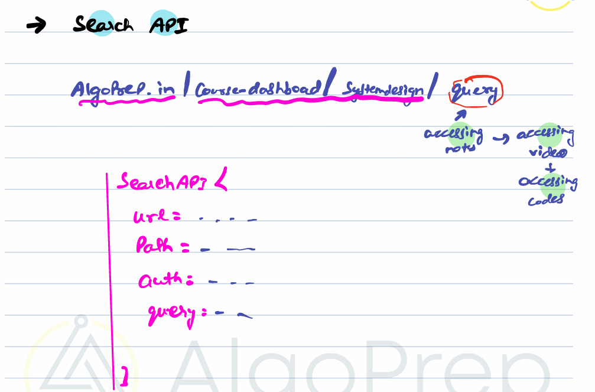
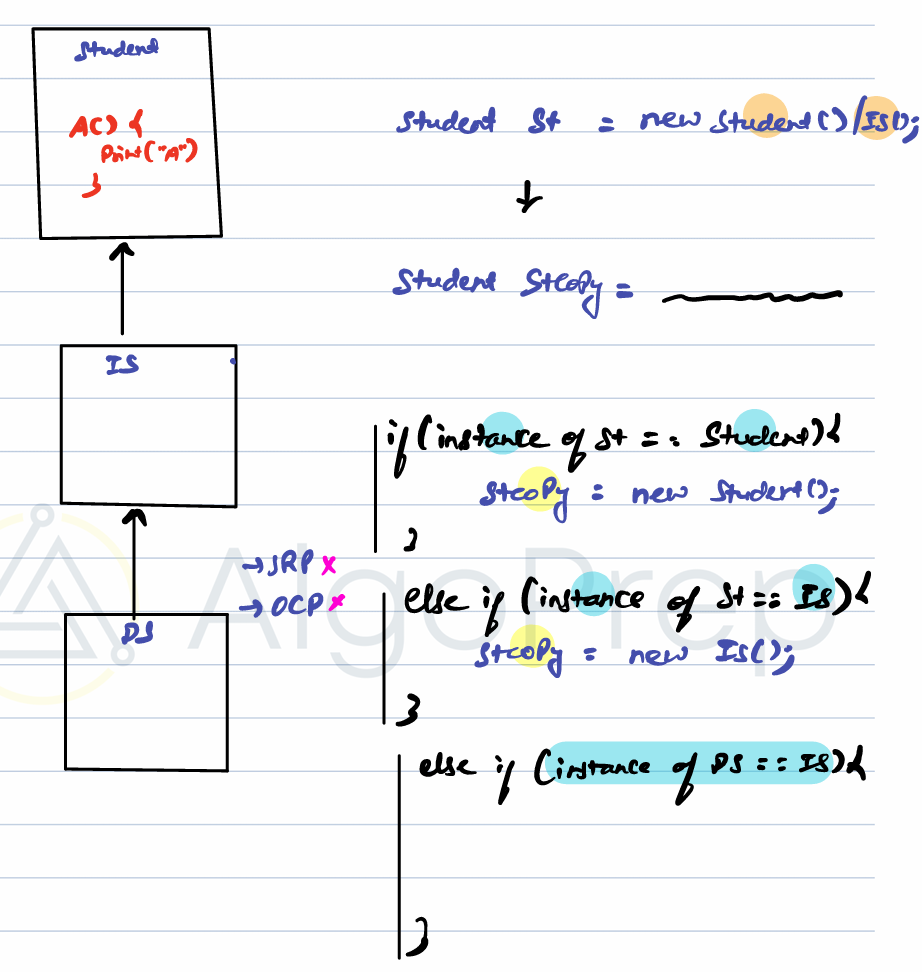
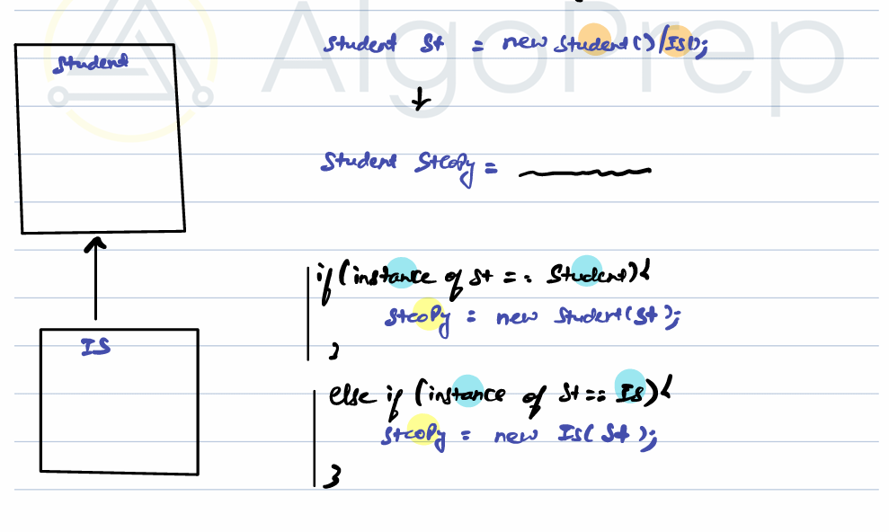
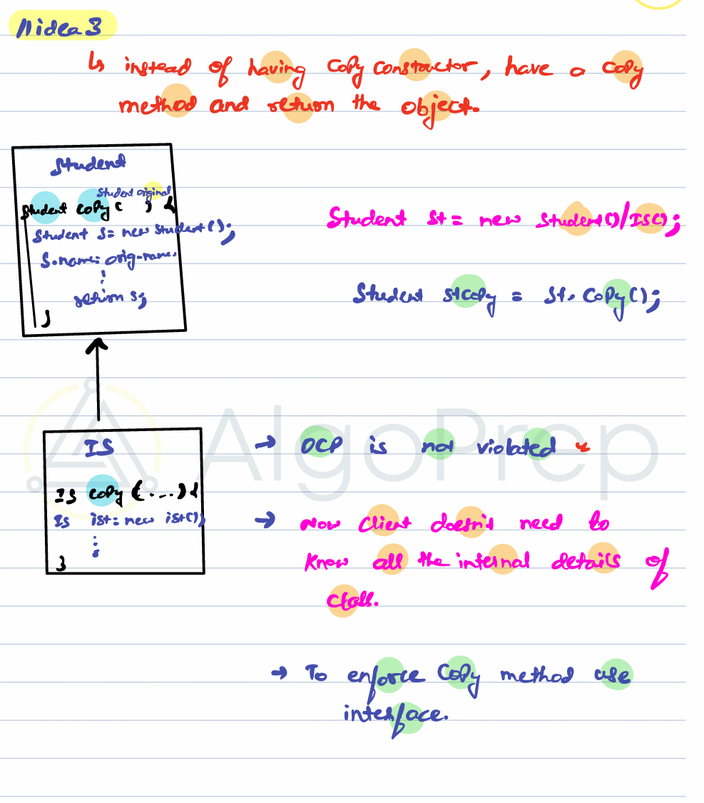
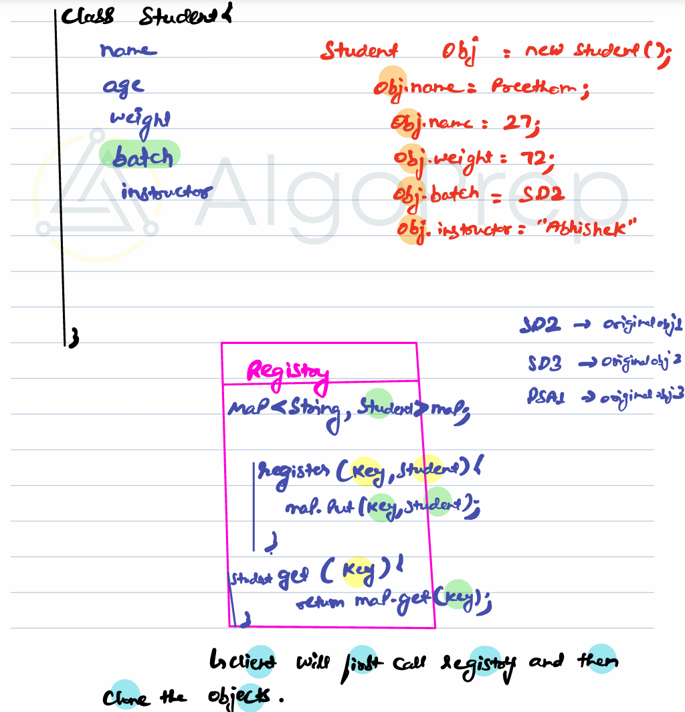
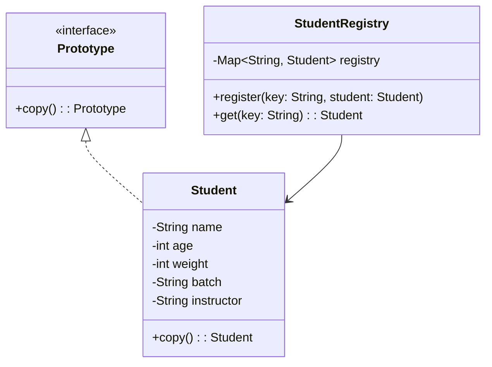

# Prototype Design Pattern

## Problem Statement

- Given an object of a class, we need to create **multiple copies** of the given object with some attributes having same value.
- There are scenarios where we don't want to create object from scratch, rather use copy of existing object and change few required attributes.(one object is created already and we want to copy that object)
- consider example of search API where we want to only change query for each search api value.



### idea 0 : not even solve the problem

```java
Student st = new Student();
Student stCopy = st;
```

### idea 1 : not even solve the problem

```java
Student st = new Student();
Student stCopy = new Student();

stCopy.name = st.name;
stCopy.age = st.age;
stCopy.weight = st.weight;
```

#### Cons

- Client needs to know all the **internal details** of the `Student` class with aal attribute list to copy
- Violates **Encapsulation**

This can also leads to problems where multiple principles is being violated



## Approach 1: Copy Constructor

This doesn't solve the previous problem of violating srp and ocp but it solves first problem where client has to know details of all attributes.

```java
class Student {
  String name;
  int age;
  int weight;

  // Copy constructor
  Student(Student original) {
    this.name = original.name;
    this.age = original.age;
    this.weight = original.weight;
  }
}

Student st = new Student("Abhishek", 24, 72);
Student stCopy = new Student(st);
```

✅ Now the client doesn’t need to know internal details.


⚠️ **Note:** All child classes must also define their **own copy constructor**.

---

## Approach 2: Copy Method (Prototype Pattern)

Instead of a constructor, create a `copy()` method.



```java
interface Prototype {
  Prototype copy();
}

class Student implements Prototype {
  String name;
  int age;
  int weight;

  Student(String name, int age, int weight) {
    this.name = name;
    this.age = age;
    this.weight = weight;
  }

  @Override
  public Student copy() {
    return new Student(this.name, this.age, this.weight);
  }
}
```

### Usage

```java
Student st = new Student("Abhishek", 24, 72);
Student stCopy = st.copy();
```

✅ Client no longer needs internal details
✅ **Open/Closed Principle (OCP)** is not violated

---

## Approach 3: Combining Copy method with registry (Final code)

We can have a registry class which basically stores initial value of object which client must create initially.



Final code

Got it 👍 I’ll extract the code from both screenshots and provide it as clean Java code.

Here’s the full code from your screenshots:

---

### `Prototype.java`

```java
package ProtoType;

public interface Prototype<T> {
    T clone();
}
```

---

### `Student.java`

```java
package ProtoType;

public class Student implements Prototype<Student> {

    private String name;
    private int age;
    private int weight;
    private String batch;
    private String instructor;

    @Override
    public Student clone() {
        Student stCopy = new Student();
        stCopy.name = this.name;
        stCopy.age = this.age;
        stCopy.weight = this.weight;
        stCopy.batch = this.batch;
        stCopy.instructor = this.instructor;
        return stCopy;
    }

    // Getters and Setters
    public String getName() {
        return name;
    }

    public void setName(String name) {
        this.name = name;
    }

    public int getAge() {
        return age;
    }

    public void setAge(int age) {
        this.age = age;
    }

    public int getWeight() {
        return weight;
    }

    public void setWeight(int weight) {
        this.weight = weight;
    }

    public String getBatch() {
        return batch;
    }

    public void setBatch(String batch) {
        this.batch = batch;
    }

    public String getInstructor() {
        return instructor;
    }

    public void setInstructor(String instructor) {
        this.instructor = instructor;
    }
}
```

---

### `StudentRegistry.java`

```java
import java.util.HashMap;

public class StudentRegistry {
    HashMap<String, Student> map = new HashMap<>();

    void register(String key, Student st) {
        map.put(key, st);
    }

    Student get(String key) {
        return map.get(key);
    }

    public void fillRegistry(StudentRegistry studentRegistry) {
        Student obj1 = new Student();
        obj1.setBatch("SD2");
        obj1.setInstructor("Abhishek");
        studentRegistry.register("SD2", obj1);

        Student obj2 = new Student();
        obj2.setBatch("SD3");
        obj2.setInstructor("Abhishek");
        studentRegistry.register("SD3", obj2);
    }
}
```

---

### `Client.java`

```java
public class Client {
    public static void main(String[] args) {
        StudentRegistry studentRegistry = new StudentRegistry();
        studentRegistry.fillRegistry(studentRegistry);

        Student Preetham = studentRegistry.get("SD2").clone();
        Preetham.setAge(20);

        Student Sahil = studentRegistry.get("SD2").clone();
        Sahil.setAge(25);
    }
}
```

## When to Use Prototype

- When object creation is **costly** or **complex**
- When you want to **avoid reinitializing** an object from scratch
- When you want to **reuse** an existing object with slight modifications

---

## Example Use Cases

- **Search APIs**
- **Authentication tokens**
- **Video processing pipelines**
- **Database entities**

---

## Diagram — Prototype Pattern


