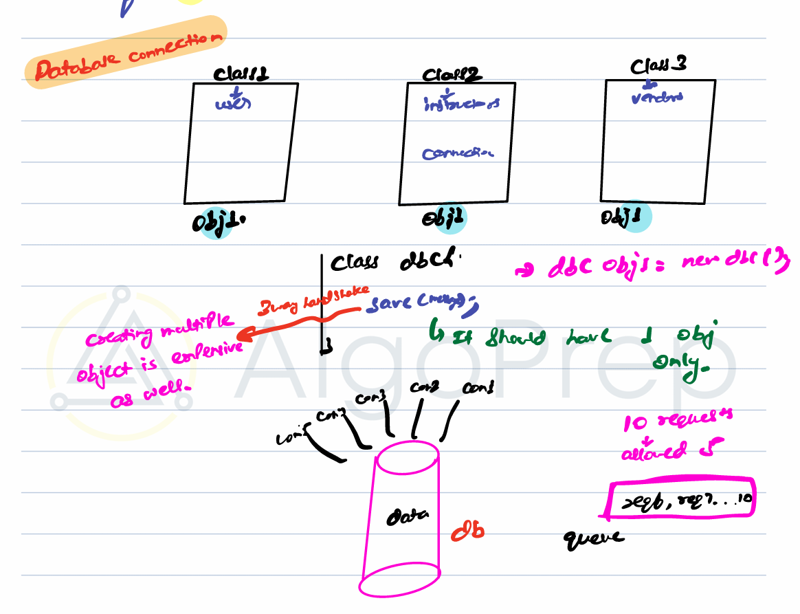
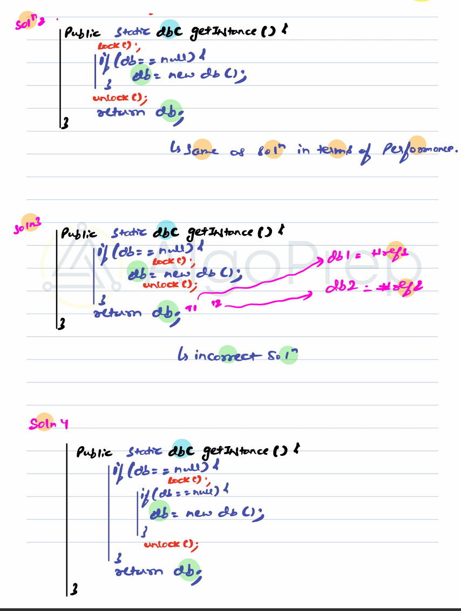
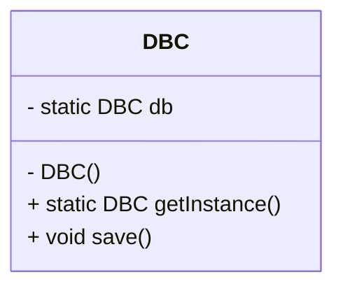

# Singleton Design Pattern

- Ensures creation of **only one object** of a class
- Useful for **shared resources** like:

  - Database connection
  - Logger
  - Configuration files
  - Thread pools
  - Queues



we can't allow all class to make their saprate connection. it will be costly and difficult to track. so we can create one object and each class can save data using that object. for ex. if we have 10req and upper limit is 5req then we can store in queue and process further.

---

## When to Use Singleton?

1. When we have a **shared resource** behind the scene, it make sense to have as single source of truth for the resources. single source of truth -> one object.
2. When creating an object is **expensive**
3. When a class has **only methods** (utility-type class)

## How to Implement Singleton

### Basic Structure

```java
class DBC {
  String url;
  String password;

  void save() { ... }
}
```

If constructor is `public`, multiple objects can be created → **not Singleton**.

---

### Make Constructor Private?

```java
class DBC {
  private static DBC db = null;
  private String url;
  private String password;

  private DBC() {} // private constructor

  public void save() { ... }
}
```

but we will not be able to create any object by making this as private.

### using static method?

```java
class DBC {
  private String url;
  private String password;

  static void save() { ... }
}
```

more static method you have used in codebase, the the loadtime it will have because all the static methods/var/class takes memory at loadtime. meanwhile object will only take memory when it is created.

### Adding a private constructor and an static method which returns object?

- next would be create a private static getInstance() so it can return object

```java
class DBC {
  private String url;
  private String password;

  private DBC() {} // private constructor

  public void save() { ... }

  public static DBC getInstance() {
    DBC db = new DBC();
    return db;
  }
}

DBC db1 = DBC.getInstance(); //will create a diff obj stored at ref1
DBC db2 = DBC.getInstance(); //will create a diff obj stored at ref2

```

So this will also not work

### Adding a private static variable and returning that form a private static method?

```java
class DBC {
  private static DBC db = null;
  private String url;
  private String password;

  private DBC() {} // private constructor

  public void save() { ... }

  public static DBC getInstance() {
    if (db == null) {
      db = new DBC();
    }
    return db;
  }
}

DBC db1 = DBC.getInstance(); //will create a diff obj stored at ref1
DBC db2 = DBC.getInstance(); //will create a diff obj stored at ref1
```

This will perfectly solves the problem as it will only operate on a single object.

**Steps:**

1. Make constructor **private**
2. Create a **static getInstance()** method
3. Maintain a **private static reference** of the class

### Thread-Safety Problem with above solution

The above implementation **won’t work in multithreaded environments**:

- Two threads may enter `getInstance()` at the same time → multiple objects created

```java
class DBC {
  private static DBC db = null;
  private String url;
  private String password;

  private DBC() {} // private constructor

  public void save() { ... }

  public static DBC getInstance() {
    if (db == null) {
      db = new DBC();    //at this point of time if two thead will execute same line of code it will end up in crating two diff ref
    }
    return db;
  }
}

DBC db1 = DBC.getInstance(); //will create a diff obj stored at ref1 in thread1
DBC db2 = DBC.getInstance(); //will create a diff obj stored at ref2 in thread2
```

This can will solved by

1. Early Initialization

   but this solution is as good/bad as using static methods. since it will get initilzed at loadtime it will load all elements of class

   ```java
   class DBC {
       private static final DBC db = new DBC();

       private DBC() {}

       public static DBC getInstance() {
           return db;
       }
   }
   ```

   - Instance created at class load time
   - Simple but **may waste resources** if object never used

2. Lazy Initialization (Thread-Safe)

   ```java
   class DBC {
       private static DBC db = null;

       private DBC() {}

       public static synchronized DBC getInstance() {
           if (db == null) {
           db = new DBC();
           }
           return db;
       }
   }

   DBC db1 = DBC.getInstance(); //will create a diff obj stored at ref1
   DBC db2 = DBC.getInstance(); //will create a diff obj stored at ref1
   ```

   - Thread-safe
   - But **synchronized makes performance super slow** because of syncronous execution. We nee to wait for each thead

3. Double-Checked Locking (Efficient)

trying to optimize by applying lock at different part



```java
class DBC {
  private static volatile DBC db = null;

  private DBC() {}

  public static DBC getInstance() {
    if (db == null) {
      synchronized(DBC.class) {
        if (db == null) {
          db = new DBC();
        }
      }
    }
    return db;
  }
}
```

- Ensures only one instance
- Uses **volatile** and **double-checking** to avoid performance issues

---

## Final Singleton Implementation

```java
public class database {
  private static volatile database db = null;

  private database() {}

  public static database database() {
    if (db == null) {
      synchronized(database.class) {
        if (db == null) {
          db = new database();
        }
      }
    }
    return db;
  }
}
```

---

### Diagram — Singleton Pattern


