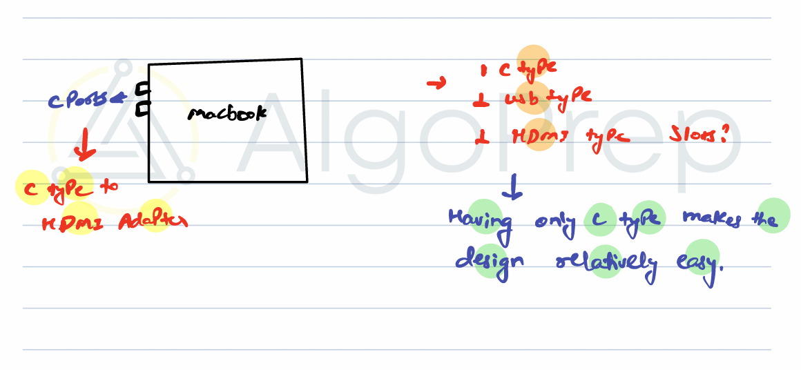
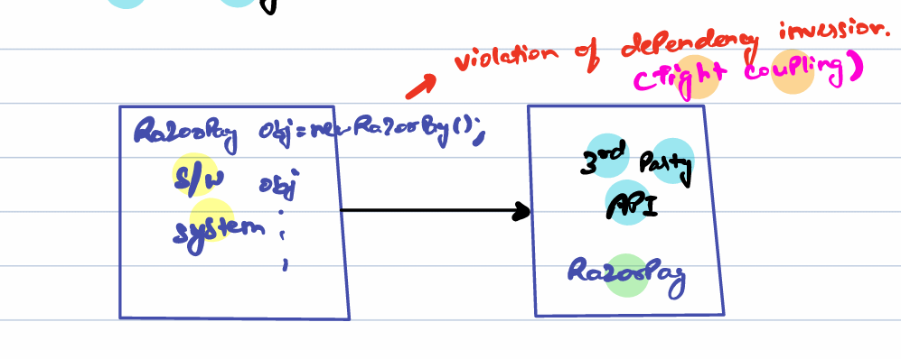
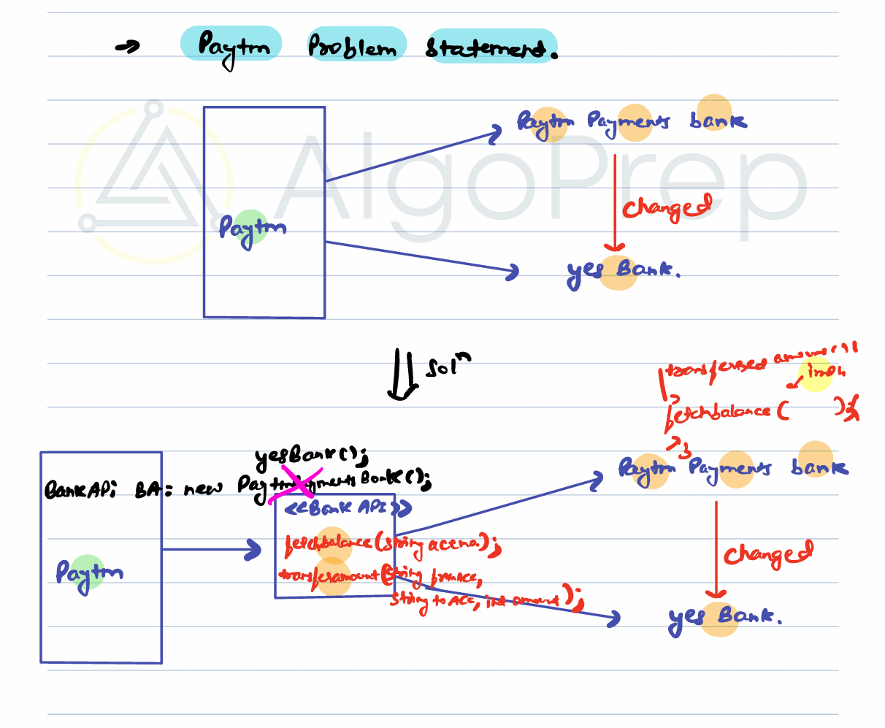
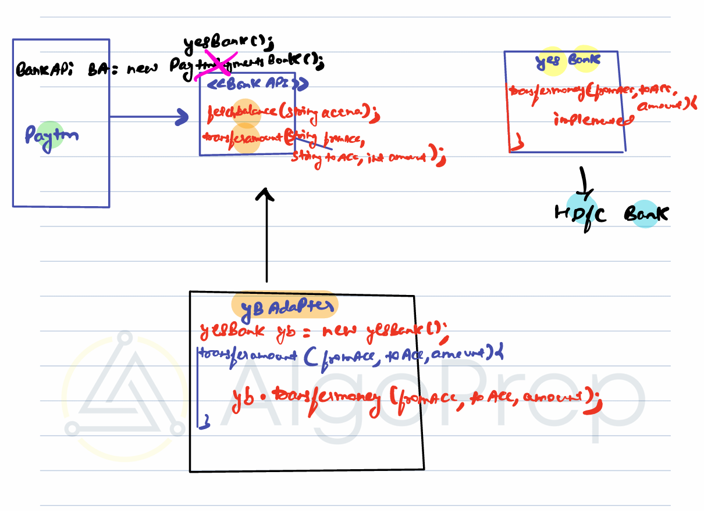
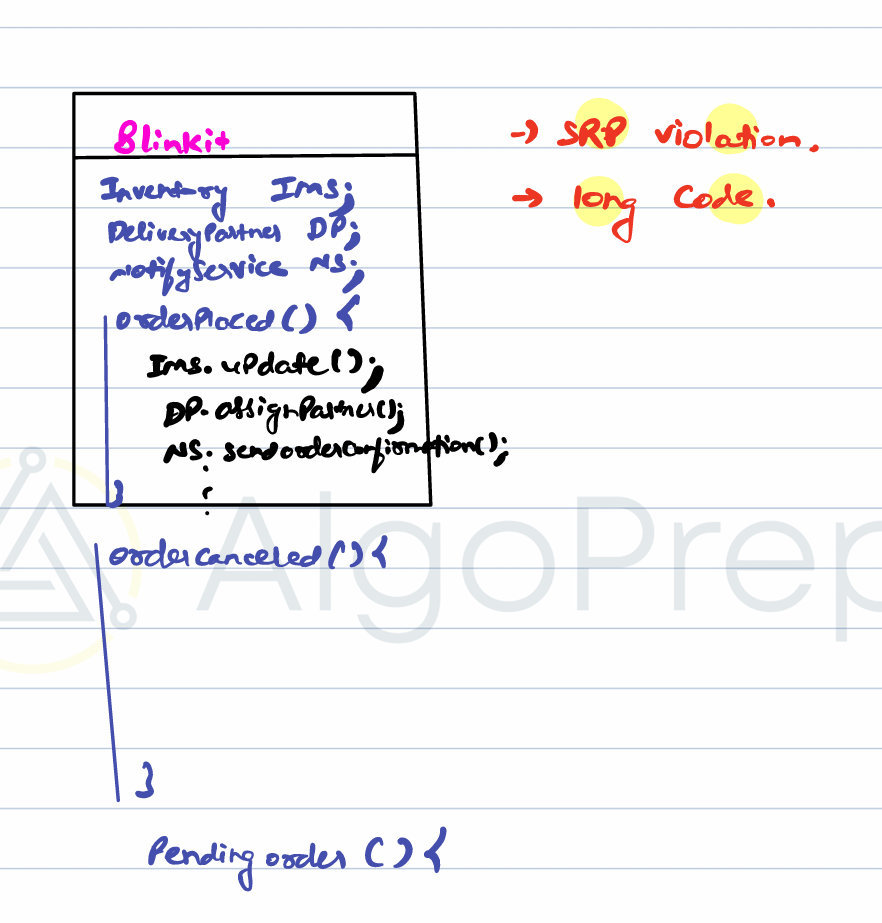
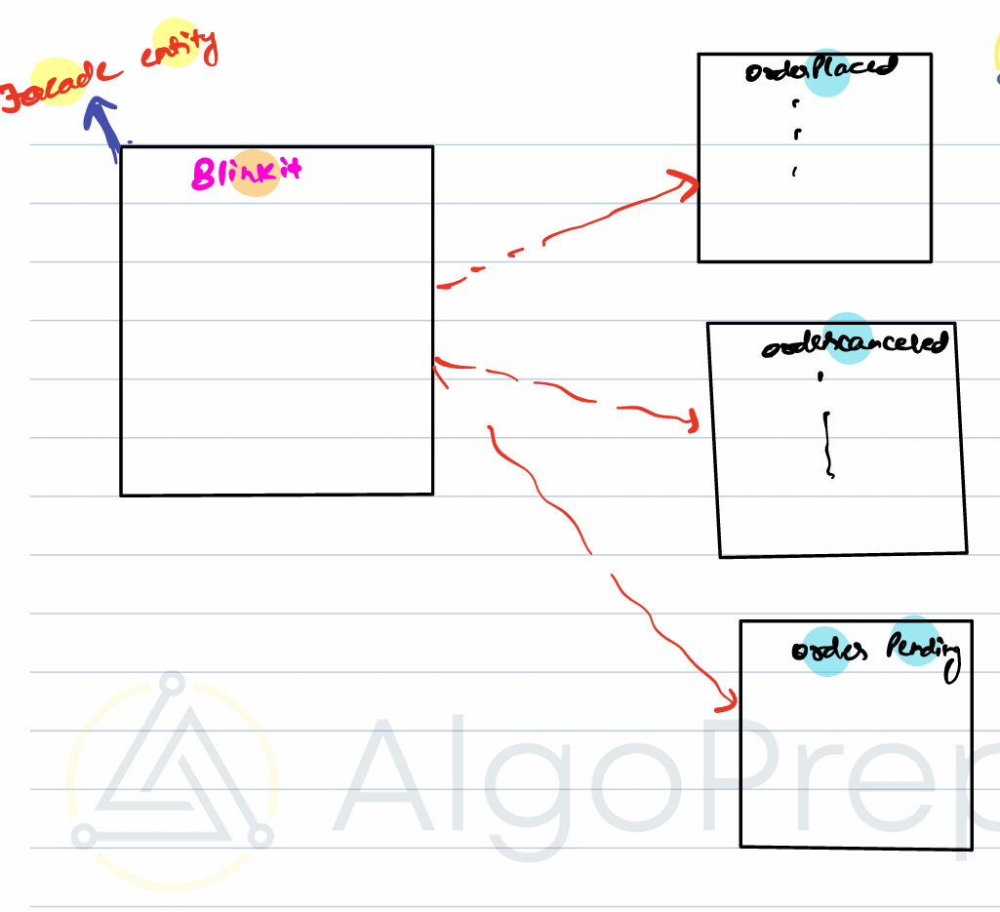

# Structural Design Pattern

- Deal with --structuring codebase--
- Decisions about:

  - Classes
  - Interfaces
  - Attributes within a class

---

## Adapter Design Pattern

- --Power Adapter-- → converts one form to another

  - e.g., `C-type`, `USB`, `HDMI` adapters



- Having only a `C-type` slot makes the design --simpler--

### Problem



- Tight coupling / Dependency Inversion violation
- Example: Payment Gateways



⚠️ Problem:

- Each bank has a different API method signature. So if we are changing any bank it is not necessary that other will have same structure.
- Client code must change whenever bank API changes → --tight coupling--.

---

### Solution: Use an Adapter

To solve this structure problem we need to introduce something in between as adapter. Inside adapter we can create our methods to call correct api to yes bank.



---

### `BankApi.java`

```java
package Adapter_Pattern;

public interface BankApi {
    int fetchBalance(String accountNo);
    boolean tranferAmount(String fromAcc, String toAcc, int amount);
}
```

### `YesBank.java`

```java
package Adapter_Pattern;

public class YesBank {
    public boolean tranferMoney(String fromAcc, String toAcc, int amount) {
        System.out.println("Yes bank has transferred the money");
        return true;
    }
}
```

### `YesBankAdapter.java`

```java
package Adapter_Pattern;

public class YesBankAdapter implements BankApi {

    YesBank yb = new YesBank();

    @Override
    public int fetchBalance(String accountNo) {
        // Not implemented yet, placeholder
        return 0;
    }

    @Override
    public boolean tranferAmount(String fromAcc, String toAcc, int amount) {
        return yb.tranferMoney(fromAcc, toAcc, amount);
    }
}
```

---

#### Usage

```java
BankAPI bank = new YesBankAdapter();
bank.transfer("A1", "A2", 500);
```

✅ Client uses a --standard interface--
✅ Any new 3rd party system only needs a new Adapter

---

### General Rule for Adapters

1. When connecting to --3rd party APIs-- → always create an interface
2. Create an --adapter class-- as a bridge between your code and the 3rd party API
3. Client code only depends on --interface--, not on the 3rd party

---

### Real World Examples

- --Calendly-- → integrates with Google Meet, Zoom, Outlook
- If APIs differ, you build adapters for each
- Competitor: --cal.com-- (open-source alternative to Calendly)

---

## Facade Design Pattern

🔹 --Facade Design Pattern--

--Definition--:
The --Facade Pattern-- is a --structural design pattern-- that provides a --simplified interface-- (a facade) to a --larger, more complex subsystem-- of classes.

- Instead of exposing dozens of classes and methods to the client,
- You create a --Facade class-- that offers a --unified, high-level API--.
- The client interacts only with the facade, while the facade delegates calls to the underlying subsystem.

### ✅ Key Points

- Belongs to --Structural Patterns-- (focuses on class and object composition).
- --Encapsulates complexity-- → hides internal subsystem details.
- Provides a --single entry point-- to multiple subsystems.
- Improves --readability, usability, and maintainability--.

### Meaning

- --Facade-- = "Outer face"
- Provides a --simplified interface-- to a complex subsystem
- Helps avoid --SRP violation-- by exposing only the required methods

-Example: Blinkit (Online Grocery)



just create a different class and facade class will interact with each other. Simplest way to SRP violation.



#### Problem with facade

Multiple subsystems:

- --Inventory Service--
- --Delivery Partner Service--
- --Notification Service--
- --Order Service--

When an order is placed:

1. `InventoryService.update()`
2. `DeliveryPartner.assignPartner()`
3. `NotificationService.sendOrderConfirmation()`

When order is canceled:

- `InventoryService.update()`
- `DeliveryPartner.unassignPartner()`
- `NotificationService.sendOrderCancellation()`

---

### Subsystems

```java
class InventoryService {
    void updateInventory(String item) {
        System.out.println(item + " inventory updated.");
    }
}

class PaymentService {
    void processPayment(String customer, double amount) {
        System.out.println("Payment of " + amount + " processed for " + customer);
    }
}

class ShippingService {
    void shipOrder(String item, String customer) {
        System.out.println(item + " shipped to " + customer);
    }
}
```

### Facade

```java
class OrderFacade {
    private InventoryService inventory = new InventoryService();
    private PaymentService payment = new PaymentService();
    private ShippingService shipping = new ShippingService();

    public void placeOrder(String item, String customer, double amount) {
        inventory.updateInventory(item);
        payment.processPayment(customer, amount);
        shipping.shipOrder(item, customer);
        System.out.println("Order placed successfully!");
    }
}
```

### Client

```java
public class Client {
    public static void main(String[] args) {
        OrderFacade facade = new OrderFacade();
        facade.placeOrder("Laptop", "John", 1200.00);
    }
}
```

---

## Key Differences

| --Aspect-- | --Adapter--                         | --Facade--                                      |
| ---------- | ----------------------------------- | ----------------------------------------------- |
| Purpose    | Converts one interface into another | Simplifies a complex subsystem                  |
| Use Case   | Integrating 3rd party APIs          | Providing one entry point for multiple services |
| Example    | Payment Gateway Integration         | Blinkit Order Processing                        |
